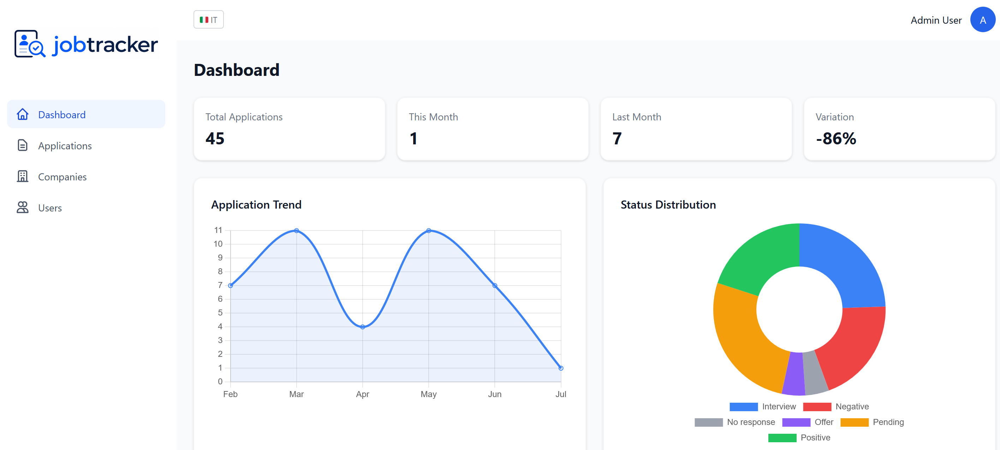
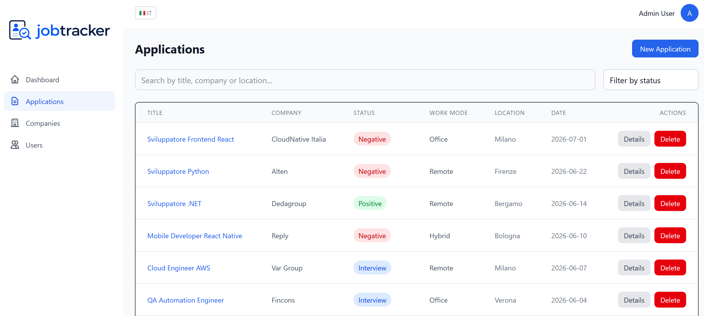
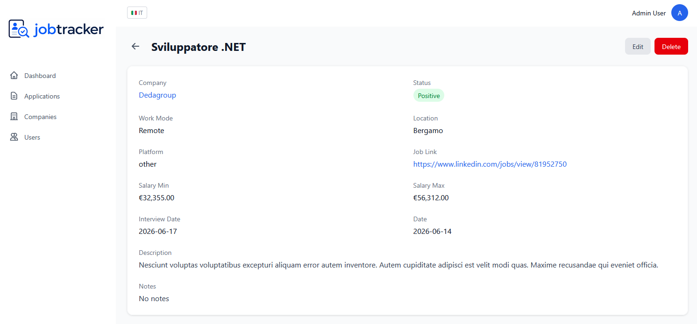
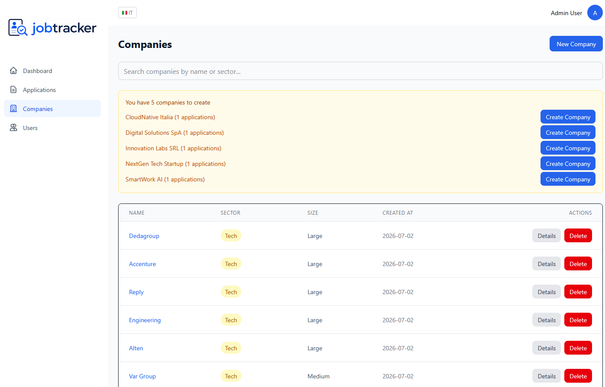
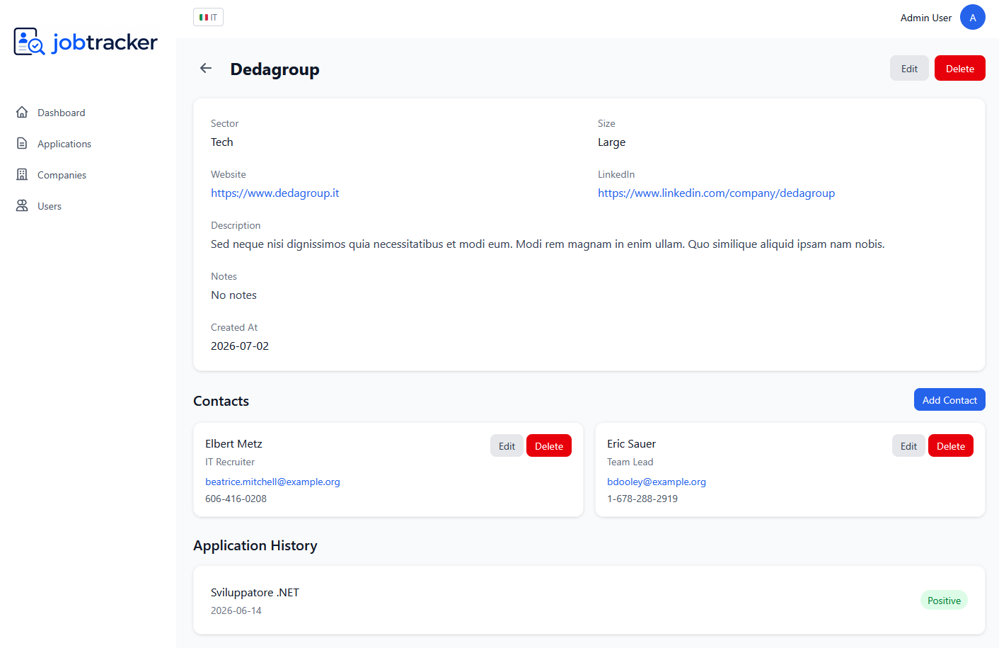
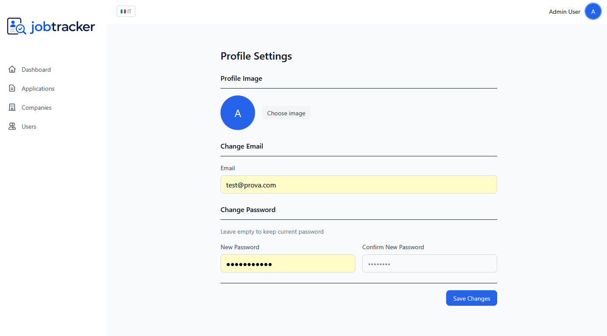
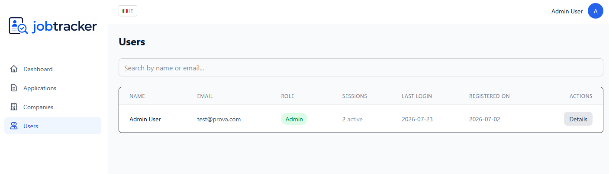

# 🚀 Job Tracker

> A modern full-stack web application built to simplify and organize the job search process.


<p align="center">
  
</p>

Job Tracker is a modern full-stack web application that helps users organize and monitor their job search by managing applications, companies, and contacts through an intuitive dashboard with real-time statistics.

Built with **Laravel**, **Vue 3**, **TypeScript**, **Tailwind CSS**, and **PostgreSQL**, the project follows a modular architecture and a RESTful API design.

---

# 📖 Overview

Searching for a job often means managing dozens of applications, companies, recruiters, and interviews. Job Tracker centralizes all this information into a single application, allowing users to track every step of their job search efficiently.

The application includes authentication, company and contact management, interactive statistics, multilingual support, and an administration area, making it a complete full-stack project rather than a simple CRUD application.

---

# 📸 Preview

| Dashboard | Applications |
|-----------|--------------|
|  |  |

---

# ✨ Features

## Authentication

- Secure authentication
- User registration
- Profile management

## Dashboard

- Interactive statistics
- Recent applications
- Application status overview
- Charts and analytics

## Applications

- Create, edit and delete applications
- Track application progress
- Advanced filtering
- Platform management

## Companies

- Company management
- Shared companies across multiple accounts
- Detailed company information

## Contacts

- Manage company contacts
- Contact information
- Company relationships

## Administration

- User management
- Admin panel
- Policy-based authorization

## Additional Features

- RESTful API
- Internationalization (English & Italian)
- Responsive interface
- Pagination
- Toast notifications
- Confirmation dialogs

---

# 🛠 Tech Stack

## Backend

- PHP
- Laravel
- PostgreSQL
- Laravel Sanctum
- Eloquent ORM

## Frontend

- Vue 3
- TypeScript
- Tailwind CSS
- Pinia
- Vue Router
- Vue I18n
- Chart.js
- Vite

---

# 🏗 Architecture

The backend follows a modular architecture organized by business domains.

### Backend Modules

```
Accounts
Applications
Companies
Dashboard
Admin
Shared
```

Each module is organized into:

- Controllers
- Services
- Requests
- Resources
- Policies
- Models

### Frontend Structure

```
Views
Components
Stores
Composables
Network
Utilities
Layouts
```

This separation keeps business logic independent from the presentation layer, improving maintainability and scalability.

---

# 📷 More Screenshots

### Application Details



### Companies



### Company Details



### Settings



### Admin Panel



---

# 🚀 Getting Started

## Backend

```bash
cd backend

cp .env.example .env
# Edit .env with your database credentials

composer install

php artisan key:generate

php artisan storage:link

php artisan migrate --seed

php artisan serve
```

## Frontend

```bash
cd frontend

npm install

npm run dev
```

---

# 📁 Project Structure

```
job-tracker
│
├── backend/
├── frontend/
├── screenshots/
├── demo.gif
├── LICENSE
└── README.md
```

---

# 🔮 Future Improvements

- Email verification
- Password reset
- File attachments
- Company logos
- Calendar integration
- Docker support
- CI/CD with GitHub Actions
- Dark mode

---

# 👨‍💻 Author

Developed by **Mal3xX**

---

# 📄 License

This project is licensed under the MIT License.